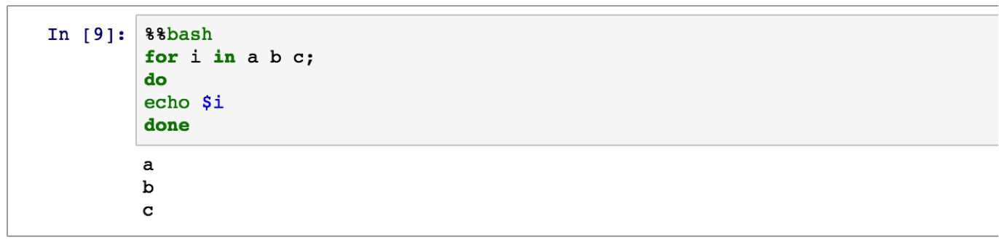
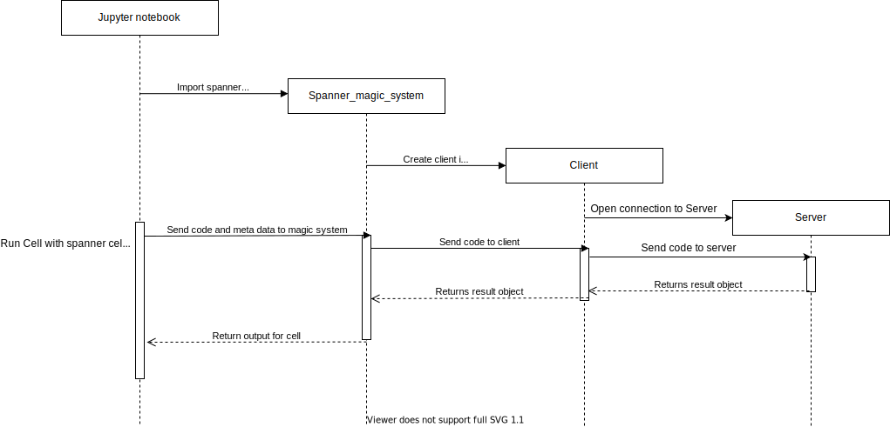
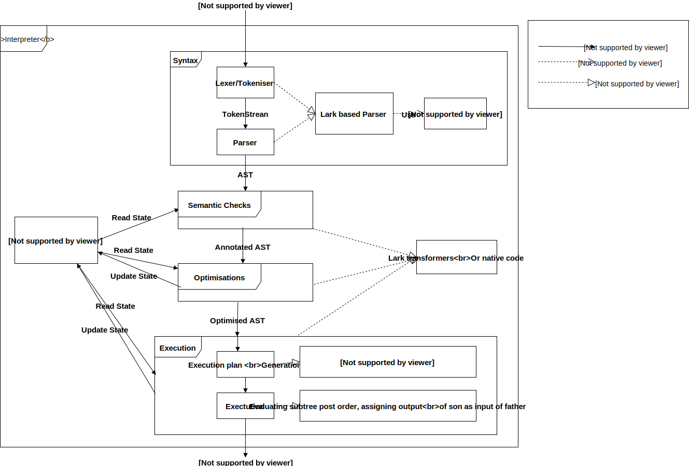
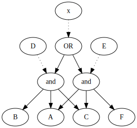
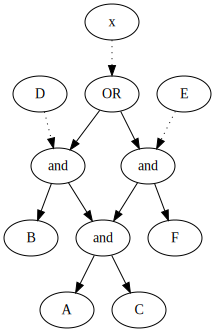

# Spanner Workbench
<!-- @import "[TOC]" {cmd="toc" depthFrom=1 depthTo=6 orderedList=false} -->

<!-- code_chunk_output -->

- [Spanner Workbench](#spanner-workbench)
  - [external resources](#external-resources)
    - [Sources of inspiration](#sources-of-inspiration)
    - [resources about building interpreters](#resources-about-building-interpreters)
    - [relevant papers](#relevant-papers)
  - [version consideration](#version-consideration)
  - [The REPL of the interpreter](#the-repl-of-the-interpreter)
  - [build of the interpreter](#build-of-the-interpreter)
      - [Lexer and Parser](#lexer-and-parser)
    - [The micro-passes in general](#the-micro-passes-in-general)
      - [design considerations](#design-considerations)
        - [version consideration](#version-consideration-1)
      - [implementation](#implementation)
        - [version considerations](#version-considerations)
    - [required passes](#required-passes)
        - [version considerations](#version-considerations-1)
  - [The Engine](#the-engine)
    - [Datalog evaluation pass](#datalog-evaluation-pass)
        - [version considerations](#version-considerations-2)
    - [regex evaluation](#regex-evaluation)
    - [garbage collection](#garbage-collection)
  - [Version 0.1](#version-01)
	  - [Session Overview](#session-overview)
		  - [Lexing And Parsing](#lexer-and-parser)

<!-- /code_chunk_output -->

The spanner workbench is an interpreter and a REPL system for spanner-like languages.
Our goal in developing the spanner workbench are two fold

* First and foremost, to allow students learning about spanner languages an easy to use system to play around with the languages.
* A later goal is to provide a easily modifiable framework that allows researchers to easily test and deploy new algorithms and optimizations to spanner languages.

## external resources

### Sources of inspiration

[Logicblox repl](https://developer.logicblox.com/content/docs4/tutorial/repl/section/split.html)
[Logicblox manual](https://developer.logicblox.com/content/docs4/core-reference/html/index.html)

LogiQL is the language implemented in logicblox and is a Dialect of [Datalog](https://en.wikipedia.org/wiki/Datalog)

Datalog in turn is derived by [Prolog](https://en.wikipedia.org/wiki/Prolog)

Here is a [python implementation of a Datalog library](https://github.com/pcarbonn/pyDatalog
)

### resources about building interpreters

[A 5 minute look at building your own language](https://www.freecodecamp.org/news/the-programming-language-pipeline-91d3f449c919/)

[Introduction to grammars and Automata](https://www.tutorialspoint.com/automata_theory/introduction_to_grammars.htm)

[Compiler design tutorials](https://www.geeksforgeeks.org/compiler-design-tutorials/)

### relevant papers

* [spannerlog](papers/spanner_log_Y_nachshon.pdf)
* [Recursive RGXLog](papers/Recures_programs_for_document_spanners.pdf)

## version consideration
* We are currently working on 0.0.5 which is the MVP of a working RGXlog REPL
  * No optimization of any kind,
  * Execution via delegation of all regexs to a regex library and all datalog fragments as is to pydatalog
* version 0.1 will have naive yet more granular execution passes and will expose a pass stack 
  * We make naive high granularity operations and allow adding optimization execution passes that target certain subtree patterns
* 0.1.1 will add the execution via compilation to automata and added atomic spanners (ie NLP extractors)
  * The production of the extractors and alg for 0.1.1 is orthogonal to the rest of the development and will be pursued independently for now.

## The REPL of the interpreter

Programming wise, the question of how to implement an interpreter is orthogonal to how to
implement a Read Evaluate Print Loop (REPL) interface for the interpreter.
You can think of it like the frontend and the backend of the app.

The way we decided to implement the front end of the workbench if to use jupyter notebook's magic system. As seen bellow, it is a system that allows you to delegate running a piece of code to an external module. Specifically for our case, we can delegate
running code that is written in our own syntax (RGXLog at the moment) to an instance of our interpreter.

Here is an example of language bash magic.


Here is schematic view of the interaction


Here is a list of resources and examples for building magic systems:

* [intro to magic usage](https://blog.dominodatalab.com/lesser-known-ways-of-using-notebooks/)
* [Guide to define your own magic system](https://ipython.readthedocs.io/en/stable/config/custommagics.html)
* [Implementation of R magic system](https://bitbucket.org/rpy2/rpy2/src/default/rpy2/ipython/rmagic.py)
  * Note that this is overkill for us, its just so you can see how a mature cross language magic system can be implemented.

## build of the interpreter

[Link to 0.1 language specification](doc/language_spec.pdf)

Here is a general schematic explanation of how our interpreter looks like. Bellow We go over the different components and implementation considerations.



Interpreters come in two flavours:

* Monolithic (Single Pass)
* Micro-pass (Multi Pass)

Both generate the AST from the string containing the source code and then have the source code go through an entire interpreting process similar to what is
shown above. While the former flavour does so in one giant pass, performing each step as soon as it can, the latter flavor defines many
sequential passes on the entire AST, each one doing a very small task.

We chose the micro-pass approach for this project as it is more modular and easier to understand for new developers. Moreover, by exposing the pass-stack in an accessible way to researchers, we can allow new algorithms/optimizations to be added to our platform with minimal effort. A researcher that wants to add his own improvement to our platform, can potentially write only a single pass and add it in the appropriate place in the pass-stack, easily leveraging the already written passes.

Both different passes of the same command, and passes from different commands will need to save or look at the state of the entire session. We will refer to this state object as the engine and will talk about its make up down bellow.

#### Lexer and Parser

The lexer and parser are used to convert the string containing the source code in the AST that defines the logical structure of the code. Lexers and parsers are often written together and come in two general flavors:

* Parser/Lexer as code
* Parser/Lexer as definition files

The former refers to writing code that parses/lexes our code directly. The problem with such parsers are that the grammar and syntax of those parsers is implicitly written within the code, with an external document explaining the syntax in general strokes. This makes changing/debugging the parser complicated, and also risks loss of knowledge as the parser and the external documentation drift further away as time goes on.

The latter approach is to have the documentation generate the code programmatically. In this case we will have a file that defines the grammar precisely in a declarative manner, and this file will be fed to a grammar-to-parser algorithm that will generate the parser automatically.

We chose the latter approach and will be using the [lark](https://lark-parser.readthedocs.io/en/latest/) python package to generate our parsers.

### The micro-passes in general

#### design considerations

Given that the micro-pass architecture will allow us modular and incremental improvement of our interpreter, in our 0.1 release we want only essential passes that our language cant function without and we want these passes to be implemented in as a naive way as possible while retaining two important constraints:

* Passes that should logically be kept separate should not be artificially merged even if that results in less code (or in code that is slightly easier to write).
* When using black box implementations for execution, we should delegate only the most lower level constructs to the black boxes, and not task them with structural decomposition. 

Let me give examples of these two constraints.
For the first constraint: Lets say that checking that IE functions are defined and 
checking that referenced variables are defined is very similar. It could be the case that 
one could check both in one pass together with less code by checking a common identifier 
pool. However, these should be written as different passes, even if their code ends up 
being similar.

For the second constraint: Since we are going to use outside datalog implementation for our execution in 0.1 it is possible to send every subtree in our AST which is in pure datalog to the external implementation. However, that would hide too much behind the external implementation and would mean that future optimizations would have the initial cost of decomposing the dependency of our program on the external datalog engine. This initial cost is too high and doesn't scale well architecturally. Instead, we should decompose datalog queries into their smallest constituents and implement the basic datalog operations by wrapping their counterparts in the external datalog engine.

##### version consideration
for 0.0.5 we waiver constraint 2 for the execution

#### implementation

Passes and their implementors differ in how involved they need or want to be in the overall structure of the tree and in how they want to address the tradeoff between independence and reliance on tools we provide for them.
One pass implementor might just want to add some data to certain nodes tha can be derived from the nodes locally.
Another pass implementor has specific low level C code that he wants to run on his own tree like data structure.

In addition to generating our Lexer and Parser, lark provides some utilities such as [iterators, visitors and transformers](https://lark-parser.readthedocs.io/en/latest/classes/)
We can use and expose them to implementers to make writing passes easier.
However, since not all implementors will want to use those or use python at all we should make 3 (and make accessible) different ways of implementing passes.

* Using visitors/transformers
* Getting the AST tree itself and writing general python code on top of it
* Getting a serialized version of the AST and other information and sending it to some other function(For example some C code)

The first two we get for free with lark. For the last one, we need to make sure that our ASTs and the state of our engine are easily serialize-able into a standard serialization protocol (such as JSON). And that we have utility functions that do the serialization and un-serialization.

##### version considerations
* the first two implementation will go to 0.0.5
* the last one will go to 0.1.0

### required passes

I will list the passes that we have to implement to have a functioning RGXLog interpreter.

Semantic passes

* existence and correct arity of IE function.
* existence of referenced variable
* existence of referenced relations
* Safety of datalog rules
* existence and access to external documents

Execution passes

* RGX extractions to relations
* Datalog evaluation
* Garbage collection


I consider the semantic passes defined here as self explanatory. Bellow I define a naive implementation for the engine upon which I can discuss how to build the naive execution passes.

##### version considerations

For semantic passes we need all of them for version 0.0.5,though we might be able to leverage pydatalog to check safety implicitly for example.

For execution passes
* In 0.0.5 we can resolve RGX extractions and then send all everything else to pydatalog.
* In the 0.1 version the execution passes can be done by simple postorder walks on the AST. with naive implementations for every operator.
* In future versions, we will need to define and implement a queue mechanism coupled with an abstract evaluation mechanism.


## The Engine

Without going into an involved derivation of the structure of this engine, i can say that we need the following constructs in out engine.

* A memory heap
  * Contains pointers to all allocated data
  * This can be a python dictionary with a `new_unused_key` generator
* A Term graph
  * This will contain all terms that exist in our engine and their dependencies on other terms. For example, the head of a conjunctive query needs to have the relations under conjunction as his children in the forest.
  * Since we allow recursive queries this wont really be a forest, but it still will have several roots.
  * This tree will need to save the evaluation state of each node (ie {computed,not-computed,dirty})
  * We can work with a networkX tree for now.
  * In version 0.0.5 we do not need to merge terms with overlapping structures, see example bellow.
  * An example of such a tree can be seen in figure 1 [here](papers/Provenance_and_Probabilities_in_Relational_Databases.pdf) (note that in that case the logic is of abstract semi-rings over terms, but the idea is the same)
* A variable table
  * A mapping between variables and the nodes they point to in the term forest
  * can be a python dict for now

Here is an example regarding the overlapping structures in the term graph.
Lets look at the following example
```
>>> D(X,Y) <- A(X),B(Y),C(X,Y,Z)
>>> E(X,Y) <- A(X),C(X,Y,Z), F(Z)
>>> x= E(X,Y) OR D(X,Y)
>>> x
```
Without merging  terms with overlapping structures,
this would naively generate something that abstractly looks like this
<!--
 digraph G {
   D_and [label="and"]
   E_and [label="and"]
   x->OR [style=dotted]
   E->E_and [style=dotted]
   D->D_and [style=dotted]
   OR -> {D_and,E_and}
   D_and ->{A,B,C}
   E_and -> {A,C,F} 
 }
-->


The weakness with this approach is that `A AND C` is computed twice.

A version of the term graph that takes care to merge terms with overlapping structures would look more like this
<!--
 digraph G {
   D_and [label="and"]
   E_and [label="and"]
   x->OR [style=dotted]
   E->E_and [style=dotted]
   D->D_and [style=dotted]
   OR -> {D_and,E_and}
   D_and ->{and,B}
   E_and -> {and,F} 
   and -> {A,C}
 }
 -->


Here, we realized that A,C is a joint component and that we need only compute it once.
This would be the automatic equivalent of a smart programmer, refactoring the query above to look like

```
>>> TEMP(X,Y,Z) <- A(X), C(X,Y,Z)
>>> D(X,Y) <- B(Y),TEMP(X,Y,Z)
>>> E(X,Y) <- TEMP(X,Y,Z), F(Z)
>>> x= E(X,Y) OR D(X,Y)
>>> x
```

### Datalog evaluation pass

To implement this we can defer to [pyDatalog](https://github.com/pcarbonn/pyDatalog).

* We can just keep an instance of pyDatalog session and call it to compute results.
* We need to find a relational representation that pyDatalog can parse, maybe some SQLAlchemy data structure. We will find one that can export itself to a lot of standard formats and create the IE extractions using that data-structure. Once we have stabilized we can decide which interface our relational representation needs to take and use the abstract interface to enable polymorphism.

##### version considerations
* For 0.0.5 Throw any subtree you can into pydatalog.
  * For results of extractions, you can insert fake new relations to the pydatalog engine
* For 0.1 we make wrappers basic operation (conjunction,recursive resolution etc) that use pydatalog. We then call these when we reach datalog operations in the term graph
  
### regex evaluation

* We can just use [python.re](https://docs.python.org/3/library/re.html) for now (v 0.0.5)
* We can wrap it with a conversion between its native syntax and our changes (for example the `(?<name>expression)` syntax from the language specification doc)
* We can extract the results into the relational representation we discussed in the datalog evaluation pass.
* python re does not resolve the overlap resolution problem (TODO find a link explaining it)

### garbage collection
For 0.0.5 lets just leave the garbage in.

For 0.1 Lets start with something really simple
* At the end of each interpretation iteration, see which items in the memory heap are not reachable from the set of nodes pointed to by the variables in the term tree.
* If a node has not been reachable for over `k` commands, delete it from the memory heap

## version 0.1
progress and overview of version 0.1 implementation will be shown here

TODO links to files

### session overview

Let's begin with the communication diagram of the session when receiving a query:

TODO add it here

As the graph shows, the session:

1. Gets a query as an input.
2. Using lark's lexer and parser, performs the lexical analysis and parsing on the query.
3. Separates the AST received from the previous stage into standalone statements.
4. Runs the semantic checks, optimization and execution passes on each statement.
5. Returns the results object. In the current implementation, the results object is a string that contains the results of the queries in the program.

All of the relevant files to the session can be found at the rgxlog.engine folder. The session is implemented at session.py

Below you can find more details about each step of the implementation of the session

#### lexer and parser

The lexical analyses and parsing is done using lark's lexer and parser.
lark's lexer and parser receive a grammar file as an input, which can be found at rgxlog.engine.grammar.lark

A handy cheat sheet that will help you to read the grammar can be found at: https://cheatography.com/erezsh/cheat-sheets/lark/

An official tutorial for lark's grammar can be found at:
https://lark-parser.readthedocs.io/en/latest/json_tutorial.html#

note that we also import token definitions from lark's common module, it can be found here:
https://github.com/lark-parser/lark/blob/master/lark/grammars/common.lark

TODO link
RGXlog tutorial can help you understand the features that this grammar provides


#### separation of the AST into standalone statements

In the current implementation, while the session receive a whole RGXlog program (a jupyter notebook cell), it performs the semantic checks, optimizations, and execution on standalone statements.

This greatly simplifies the implementation of the passes, as they don't have to keep track of previous statements. Instead, a pass can get the context it needs from the symbol table.

Currently, the session will check and execute the statements one by one until the program ends, or an error is encountered in one of the statements.

An error will not cause a reversion of the program state, meaning that even state updates from the passes that processed the faulty statement will be saved (this should be fixed in future versions when the pyDatalog engine is no longer used, more on that at TODO link here).


